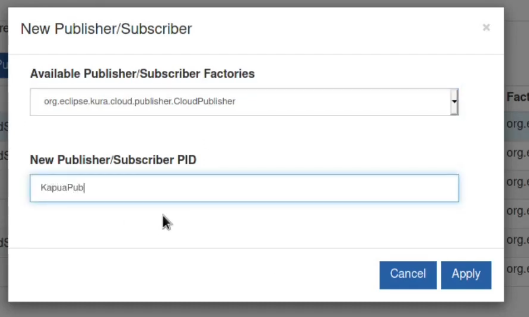

# Code-Free Smart agriculture

Optimizing plant growth and minimizing human effort.

One of the fastest ways of getting started with eclipse IoT Projects requiring limited to no-code!

(v1.0.0, Nov 4 2020)

## Business/Use Case

#### What is the problem?

> "Action is needed now to ensure that the required 70 percent increase in food production is achieved, and that every human being has access to adequate food. " - **[UN Food and Agriculture Organization](http://www.fao.org/fileadmin/templates/wsfs/docs/expert_paper/How_to_Feed_the_World_in_2050.pdf)**

The practice of farming has been done for centuries and techniques have been improved over many generations. There are [currently 7 billion people on earth and this number is projected to grow to over 10 billion by the end of this century.](https://www.pewresearch.org/fact-tank/2019/06/17/worlds-population-is-projected-to-nearly-stop-growing-by-the-end-of-the-century/) Even with the many improvements in farming we have had over the years, never has the human race been faced with the challenge of feeding so many people. Not only is there clearly a increased need for food but this need brings with it an increased demand for farmland. The issue with more farmland is that creating it directly correlates with the destruction of natural developments and deforestation. Our traditional methods of farming do not scale. The larger a farm is, the harder it is to manage, and the more waste is created. By optimizing the yields of farms we can produce more produce without having to destroy more natural land. Not only is it expensive to produce food, but delivery and transportation of produce has huge environmental ramifications.

#### What is the solution

Plants are very complex organisms that require specific conditions to flourish. [Farming can be boiled down to setting the optimal conditions to allow plants to grow.](https://www.chelseagreen.com/2019/go-lean-eliminate-waste-increase-efficiency-farm/) Ideally we would be able to ask a plant what it requires, however this is science fiction. The best that we can do is develop quantifiable and actionable metrics to determine the optimal conditions a plant requires and develop enclosures designed to mimic these conditions exactly. Using IoT we can place sensors next to plants to allow for data collection. With these sensors we can track the plants over time and then leverage the data to make actionable conclusions such as when to harvest, water, and fertilize. Many Farmers [rely on key performance metrics to ensure that their farm is operating optimally.](https://easternpeak.com/blog/iot-in-agriculture-technology-use-cases-for-smart-farming-and-challenges-to-consider/) These farming metrics include: yield per plant, water per output, work per output, and chemicals per output. A custom plant enclosure allows us to maintain optimal growth conditions irregardless of location or season. The low cost and open source nature of this project empowers individuals to begin small scale IoT farming in their own home.

#### _Why is this important?_

Farmers utilize their intuition to decide when a certain action is required to be done to their crops. Utilizing IoT we can begin empowering agriculturalists with the data necessary to make crucial decisions without any guess work. Data driven decision making leads to optimized produce yields and custom plant enclosures also allow us to move farming activities to inner cities where there is a higher demand for food.

#### _Key benefits_

- Cost effective
- Accessible to all
- Little to no-code required
- Enclosure allows for higher humidity and temperatures then ambient

**Keywords/Verticals:** IoT, Agriculture, Smart Cities, Data Management, No-code

## Architecture

#### _Visual representation of the solution._


#### What components is the demo using?

###### Software Components

- **[Eclipse Mosquitto](https://mosquitto.org/)**
  - Light weight messaging protocol which works over tcp/ip
- **[Eclipse Streamsheets](https://cedalo.com/)**
  - Allows for easy aggregation all while allowing for very beautiful UI/Dashboards.
- **[Eclipse Kura](https://www.eclipse.org/kura/)**
  - Extensible open source IoT Edge Framework and gateway.
- **[Eclipse Kapua](https://www.eclipse.org/kapua/)**
  - Modular IoT cloud platform to manage and integrate devices and their data.

**Hardware Components**

- x86 based Docker machine (can also be done with 1-3 different computers & raspberry-pi's)
- Planter
- Node MCU
- HC-SR04 -- ultra sonic sensor (Ideally one that is 3.3v compatible)
- photo-resistor
- DHT11 -- Humidity and Temperature sensor
- (optional) LED Grow-light

## Implementation

**Cloud Layer:**

- Kura allows for management and storage of many Edge Nodes

**Edge Agent Layer:**

- Kura polls Mosquitto broker, routing MQTT messages to Kapua and Streamsheets

**Internet of Things Layer:**

- Smart Greenhouse polls sensors and sends MQTT messages to Kura Broker

## How to run

**_Note:_** to make installation easier, it is recommended to install portaner on the 'master-agent' machine

Ideally this stack will be deployed on different machines

**Prerequisites**

1. Install docker

   - https://docs.docker.com/engine/install/ubuntu/

   - ```bash
     #Remeber to give your user permission to use docker

     sudo usermod -aG docker $USER
     ```

2. Install Portaner

   ```bash
   docker volume create portainer_data

   docker run -d -p 8000:8000 -p 9000:9000 --name=portainer --restart=always -v /var/run/docker.sock:/var/run/docker.sock -v portainer_data:/data portainer/portainer-ce
   ```

**Installation Guide**

1. **Install kapua**

   ```bash
   #Follow this link: https://www.eclipse.org/kapua/getting-started.php

   #Linux/MacOS
   $ git clone https://github.com/eclipse/kapua.git kapua
   $ cd kapua/deployment/docker/unix
   $ ./docker-deploy

   #Windows Powershell
   PS C:\Projects> git clone https://github.com/eclipse/kapua.git kapua
   PS C:\Projects> cd kapua\deployment\docker\win
   PS C:\Projects\kapua\deployment\docker\win> ./docker-deploy.ps1

   #Defualt Credentials

   		Web Console
       http://127.0.0.1:8080/
       Username: kapua-sys
       Password: kapua-password

   		Message Broker
       tcp://127.0.0.1:1883/
       Username: kapua-broker
       Password: kapua-password

   		RESTful APIs
       http://127.0.0.1:8081/doc
       Username: kapua-sys
       Password: kapua-password

   #note: the docker containers wont automatically reboot, you will have to manually re-enable them on boot
   ```

2. **Install Kura**

For my purposes Eclipse Kura was installed on a x86 machine though docker. It is possible to install Kura directly on a raspberry pi

```bash
#x86 Kura Docker Image on a diffrent machine
docker run -d -p 8080:8080 -p 1883:1883 -t eclipse/kura

#If you will like to install on the same machine change host ports, becuse they will conflit with kura
```

3. **Install Mosquitto (same machine as Kura)**

   Kura Comes pre-loaded with an Apache active MQ MQTT server. Sadly the pub-sub client used on the NodeMCU is unable to communicate with this broker. In order to remedy this the decision to use Eclipse-Mosquitto was made.

   ```bash
   docker run -it -p 1883:1883 -p 9001:9001 eclipse-mosquitto
   ```

4. **Install Streamsheets**

   ```Bash
   #x86 Streamsheets Imgage
   docker run -d -p 1883:1883 -p 27017:27017 -p 6379:6379 -p 8080:8080 -p 8081:8081 -p 8083:8083 -p 8088:8088 -p 9001:9000 cedalo/streamsheets:latest
   #possible to install with raspberryPi, but currently only avalible though installation directly on hardware
   #Note: if you want to run this on the same machine remeber to change the host port for ports 8080 & 1883
   ```

   

5. **(OPTIONAL) - For Users running entire stack on one machine**

   In-order to get docker containers to talk to each-other, one must create a bridged network.

   Open Portainer (localhost:9000)

   **Create Network:**

   Networks > Add network > set Name > set Driver to Bridge > Create Network

   

   **Add Containers to the Network:**

   Dashboard > Containers > <Container Name> > ScrollDown > Select Network > Join Network

   

6. **Configure Node MCU**

**Sensors Used**

- HC-SR04 -- ultra sonic sensor (Ideally one that is 3.3v compatible)

- photo-resistor

- DHT11 -- Humidity and Temperature sensor

  Using the Arduino IDE flash the NODE MCU with the .INO file presented in this repo. Follow this image when wiring up your NODE MCU with sensors.

  

  

# **Setup Guide**

1. Connecting the Node MCU to Eclipse Mosquitto Broker

   - Open the "miniGreenhouseMqtt.ino" in Arduino studio

   - Install/Download dependencies (Tools > Manage libraries) or (Tools > Board > BoardManager)

      **1) NodeMCU library:** https://arduino.esp8266.com/stable/package_esp8266com_index.json

      **2) PubSubClient:** https://github.com/knolleary/pubsubclient

      **3) Arduino_JSON:** https://arduinojson.org/

      **4) Adafruit Unified Sensor Driver:** https://github.com/adafruit/Adafruit_Sensor

      **5) DHT sensor library:** https://github.com/adafruit/DHT-sensor-library

   - Edit the configuration in the .h file and upload to the NodeMCU

   - Reboot (unplug and replug) NodeMCU after Installing

   - If everything is configured correctly The serial monitor output should look like this 

2. Connecting Eclipse-Kura to Eclipse-Mosquitto

   - Open Kura web UI, Default Credentials are; User: admin, Password: admin

   - navigate to Cloud Connections > New Connection, set Cloud Connection Factory PID to org.eclipse.kura.cloud.cloudService

   - 

   - Match The Settings Below in the "CloudService-" tab

     - Device Display-Name: Custom
     - Device Custom-Name: PD1
     - Payload Encoding: Simple JSON
     - Press Apply
     - 
     - 

   - Match the Settings Below in the "MqttDataTransport-" tab

     - Broker-url: --Depends on your setup--
     - Topic Context Account-Name: account-name
     - Username: --Depends on your setup--
     - Password: --Depends on your setup--
     - Client ID: PD1

   - Highlight the service and press connect. If Successful status should read Connected

   - Create a Publisher,

     - click Service PID you would like to add publisher too (the one we just set up)

     - Select New Pub/Sub

       - 
       - Click the New publisher
         - Change Application Topic: A1/Echo

     - Create Subscriber

       - 

       - We Must be sure to match the topic in which the Node MCU is publishing on

       - Kura will suscribe to a topic based off the information we put into the cloud server,

         ```
         Data Message Topics: <account_name>/<client_id>/<application id>/<application topic>
         ```

       - Set..

         - Application ID: W1
         - Application Topic: A1/PlantData

       - 

       - Navigate to Wire Graph

         - Click Subscriber and name it "localMQTTSub"
           - click the node on the graph, scroll down and set it's PID the subscriber name
           - 
         - Click Publisher and name it "localMQTTPub"
           - set the PID to the correct publisher
         - Finally Connect the two nodes and press Apply
         - Wire Graph should look something like this in the end
         - 

3. Connecting Eclipse Kura to Streamsheets

   - Note: Upon spinning up a new image of Steamsheets a new random Mosquitto MQTT password is generated locally. In order to send data to Streamsheets we must find this password.
   - Open Streamsheets
     - Hamburger menu > Administration > Consumers > MQTT_Consumer > More
     - Scroll Down to reveal User-name and Password Fields.
     - 
   - Open Kura, and just as demonstrated before create a new Cloud Service
     - 
     - As Before:
       - Select The new factory
       - Device Display-Name: Custom
       - Device Custom-Name: PD1
       - Payload Encoding: Simple JSON
       - Press Apply
     - Click MqttDataTransport-
       - 
       - Fill in the above details, Ensure that the Username & Password are copied from the Streamsheets consumer
       - Highlight the service and press connect. If Successful status should read Connected
     - Create Publisher
       - 
     - Navigate To Wire Graph
       - Create new publisher
         - Set PID to streamsheets.pub
         - connect localMqtt to the new publisher
         - press apply
         - Final Graph should be as follows
         - 
     - Open Streamsheets
       - Create a new App: Hamburger Menu > New
       - Name the app and Select MQTT_Consumer
       - 
       - press ADD
       - Once the new APP has opened press play and wait for MQTT Messages to show up in the inbox on the left of the screen
       - 
       - Drag Data in from the inbox into the spreadsheet to utilize the data
       - To learn more about Streamsheets please see the docs here: https://docs.cedalo.com/

4. Connecting Kura To Kapua

   - Open up kura and log in with the credentials: User: kapua-sys, Password: kapua-password
   - Follow the following guide to create a child account/Tenant: https://github.com/eclipse/kapua/blob/develop/docs/kuraKapuaDocs.md
   - Create a Device from the User123 Account
   - 
   - After creating the accounts open Kura
     - Create New Cloud Connection
     - 
     - In the Cloud Service Tab
       - Device Display-Name: Custom
       - Device Custom-Name: plantMan
       - Payload Encoding: Eclipse Protobuf
       - 
     - In the MqttDataTransport- tab
       - Broker-url: mqtt//<ip>:1883/
       - Topic Context Account-Name: Account123
       - Username: User123
       - Password: --Depends on your setup--
       - Client ID: plantMan
       - 
       - Highlight the service and press connect. If Successful status should read Connected
     - Create a New Publisher
       - 
       - Set The Application ID & Application Topic
         - Application ID: Plants
         - Application Topic PlantData/
         - Press Apply
         - 
     - Navigate to the Wire Graph
       - Create a new publisher called KuraPub
       - Select the KuraPID
       - Connect localMQTT to KuraPIB
       - Press Apply
       - 
     - This is how the cloud Connections page should look in the end
       - 
